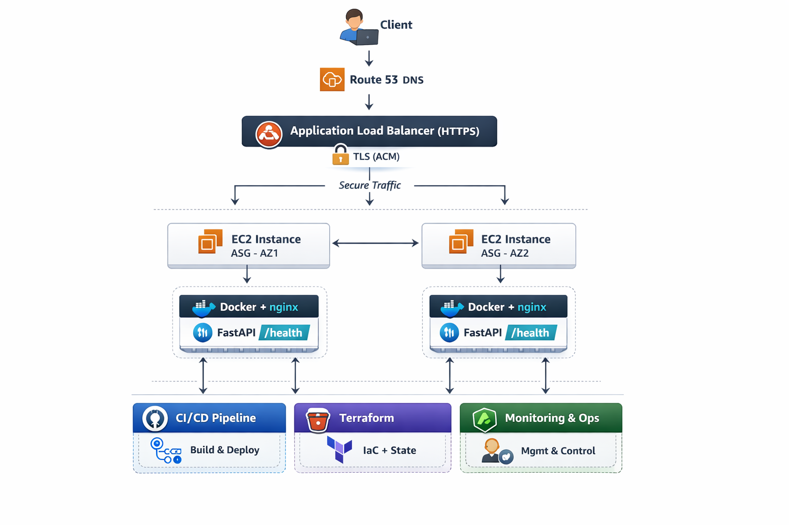

---

## AWS CI/CD Infrastructure – Cloud-Native Immutable Platform

This project demonstrates a **production-style AWS platform** built using Terraform and GitHub Actions with OIDC authentication.

It implements a **fully automated, immutable deployment pipeline** where infrastructure, application, and runtime are all controlled through Git.


---

## Key Highlights

```text
• End-to-end CI/CD-driven infrastructure provisioning
• Immutable deployments using commit SHA image tagging
• OIDC-based authentication (no static AWS credentials)
• Multi-AZ high availability with Auto Scaling
• Fully containerized runtime with automated bootstrapping
• Safe destroy workflow for cost control
```

---

## Architecture 



---

## Architecture Layers

### 1. Bootstrap Layer

Establishes the **foundation and trust boundary**:

* GitHub OIDC provider
* IAM deploy role
* S3 backend (Terraform state)

Key outcome:
→ Enables **secure CI/CD without static credentials**

---

### 2. Infrastructure Layer (Terraform)

Modular infrastructure provisioning:

```text
Modules:
• ECR → container registry
• IAM → roles & instance profile
• ACM → TLS certificates
• ALB → HTTPS ingress
• Compute → Launch Template + ASG
```

Key features:

* Multi-AZ Auto Scaling (HA)
* IMDSv2 enforced
* HTTPS enforced (ALB)
* Route53 integration
* Rolling instance refresh

---

### 3. CI/CD Layer (GitHub Actions)

Two independent pipelines:

#### App Pipeline

```text
Trigger: app/**

Flow:
• Build Docker image
• Tag with commit SHA
• Push to ECR
```

#### Infra Pipeline

```text
Trigger:
• terraform/**
• workflow_run (post app deploy)

Flow:
• Terraform apply
• Update Launch Template
• ASG rolling refresh
```

Key design:
→ **Decoupled pipelines + immutable deployments**

---

### 4. Runtime Layer

EC2 bootstraps automatically using user-data:

```text
• Install Docker
• Authenticate to ECR (IAM role)
• Pull image (commit SHA)
• Start container
• Enable SSM (no SSH)
```

Inside container:

```text
nginx → FastAPI (/health)
```

---

### 5. Operational Layer

Safe infrastructure lifecycle control:

```text
• Dedicated destroy workflow
• Manual trigger (workflow_dispatch)
• Explicit confirmation required
```

Purpose:
→ Prevent accidental deletion + control AWS costs

---

## Deployment Flow

```text
Code Push → GitHub Actions → Build Image → Push to ECR
→ Terraform Apply → Launch Template Update
→ ASG Instance Refresh → New Instances Pull Image
```

---

## Security Design

```text
• OIDC authentication (no AWS keys)
• Least-privilege IAM roles
• Separate deploy and runtime roles
• Private EC2 instances (no public exposure)
• HTTPS enforced via ALB
```

---

## Repository Structure

```text
.
├── bootstrap/
├── terraform/
│   └── modules/
├── app/
├── .github/workflows/
```

---

## ⚙️ Engineering Principles

```text
• Immutable infrastructure
• Git-driven deployments
• Infrastructure as Code
• High availability (multi-AZ)
• Secure authentication (OIDC)
• Automated recovery (ASG)
```

---

## Tech Stack

AWS (EC2, ASG, ALB, ECR, IAM, S3, Route53, ACM, SSM, CloudShell)
Terraform
GitHub Actions (OIDC)
Docker
FastAPI
nginx


---
