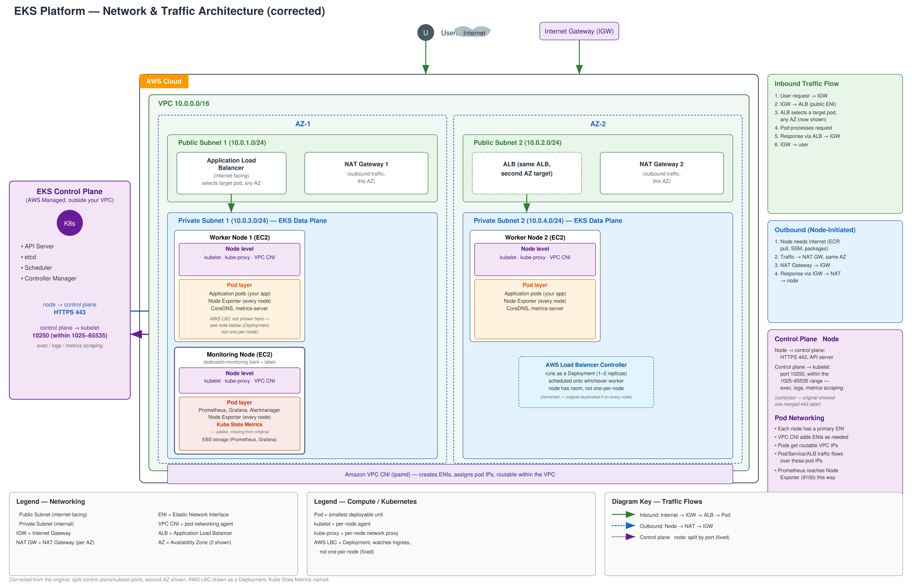

# AWS EKS Platform – Cloud-Native Kubernetes Platform
> AWS platform built using Terraform, EKS, and Helm, following production-grade infrastructure and security practices, secure Pod Identity-based IAM, isolated observability, and cost-aware autoscaling.
---


<br/>


This project rebuilds, as an independent portfolio project, a platform originally built at Oracle. The original implementation stayed with Oracle as proprietary IP, so this repo is a from-scratch recreation of that architecture, continued after a 2025 layoff.

It follows **production-grade infrastructure and security practices** built using Terraform and Helm, with EKS Pod Identity replacing static credentials or OIDC trust policies throughout.

---

## Key Highlights

```text
• Modular Terraform across 5 modules (IAM, EKS, Pod Identity, CloudWatch, ACM)
• EKS Pod Identity for AWS access, no OIDC provider, no per-role trust policies
• Dedicated, tainted monitoring node group, isolated from application workloads
• Proactive CloudWatch alarm at 95% node capacity, ahead of Cluster Autoscaler's own ceiling
• Zero hardcoded secrets, SMTP credential pulled from SSM via External Secrets Operator
• Full observability stack via kube-prometheus-stack, scoped to the monitoring node
• Least-privilege IAM per component, including tag-scoped Auto Scaling permissions
```

---

## Architecture



### How It Works (Current, End-to-End Flow)

```text
1. Developer pushes code to GitHub

2. GitHub Actions:
   → Builds Docker image
   → Tags with commit SHA
   → Pushes image to ECR

3. Helm values.yaml is updated with the new image tag and deployed
   (manual `helm upgrade` today; GitOps via ArgoCD is on the roadmap,
   see Known Limitations)

4. New pods roll out via the Deployment's rolling update strategy,
   gated by liveness and readiness probes

5. Traffic flow:
   Client → ALB (via AWS Load Balancer Controller, watching the Ingress)
   → Service → Pod
```

---

## Architecture Layers

### 1. IAM & Pod Identity Layer

Establishes the platform's **trust boundary**, without relying on OIDC:

* Pod Identity Agent addon (DaemonSet, intercepts credential requests on every node)
* Least-privilege IAM roles + Pod Identity Associations for AWS Load Balancer Controller, External Secrets Operator, the EBS CSI driver, and Cluster Autoscaler
* No OIDC provider, no per-role trust policy JSON, no breakage on cluster rebuild

---

### 2. Infrastructure Layer (Terraform)

Modular infrastructure provisioning:

```text
Modules:
- IAM         → EKS cluster role, node group role, EBS CSI driver role
- EKS         → control plane, app node group, dedicated monitoring node group,
                security groups, IMDSv2-enforced launch template
- Pod Identity → addon + IAM roles/associations for AWS-integrated components
- CloudWatch  → SNS-backed alarm at 95% of node group capacity
- ACM         → DNS-validated TLS certificate via Route 53
```

Key features:

* Dedicated monitoring node group, tainted *and* labeled so scheduling exclusion and node affinity both work correctly
* IMDSv2 enforced on all worker nodes
* Shared `gp3` StorageClass defined in Terraform via the Kubernetes provider, not inside any single Helm chart, since it's a cluster-scoped resource multiple releases depend on

---

### 3. Deployment Layer (Helm)

Four independent Helm releases:

```text
- ehr-app             → custom chart, Deployment/Service/HPA/Ingress/Namespace/RBAC/ServiceAccount
- kube-prometheus-stack → Prometheus, Alertmanager, Grafana, Node Exporter, Kube State Metrics
- cluster-autoscaler   → autoDiscovery via ASG tags, tuned scale-down behavior
- external-secrets     → fetches the Alertmanager SMTP password from SSM
```

Key design:
→ Observability, secrets, and autoscaling are separate, focused releases rather than one monolithic deployment.

---

### 4. Runtime Layer

Pods run the EHR FastAPI application behind nginx, built from a Docker image tagged with the Git commit SHA. Liveness (`/health`) and readiness (`/ready`) are checked separately, so the kubelet distinguishes "alive but not ready yet" from "actually broken."

---

### 5. Observability Layer

Monitoring stack running on the dedicated monitoring node:

```text
- Prometheus         - 15-day retention, 30s scrape interval, 20Gi persistent storage
- Grafana             - dashboards, 5Gi persistent storage
- Alertmanager        - Gmail SMTP alerting, credential from SSM via ESO
- Node Exporter       - runs on every node (DaemonSet), not pinned to monitoring
- Kube State Metrics  - cluster object state (pod status, replica counts, HPA state)
```

---

### 6. Security Design

```text
• EKS Pod Identity throughout, not IRSA
• Least-privilege IAM per component (e.g. Cluster Autoscaler's mutating
  permissions are scoped via a resource-tag condition to only its own ASG)
• IMDSv2 enforced on all worker nodes
• No SSH access configured, node access is SSM-only by default
• No hardcoded secrets, SMTP credential lives in SSM as a SecureString
```

---

## Repository Structure

```text
.
├── main.tf
├── variables.tf
├── outputs.tf
├── modules/
│   ├── iam/               # EKS cluster role, node group role, EBS CSI driver role
│   ├── eks/                # Cluster, node groups, security groups, EBS CSI addon
│   ├── pod-identity/        # Pod Identity Agent + IAM roles/associations
│   ├── cloudwatch/          # SNS + capacity alarm
│   └── acm/                 # TLS certificate + Route 53 DNS validation
├── helm/
│   ├── ehr-app/
│   │   ├── Chart.yaml
│   │   ├── values.yaml
│   │   └── templates/       # deployment, service, hpa, ingress, namespace, rbac, serviceaccount
│   ├── kube-prometheus-stack/
│   │   └── values.yaml
│   ├── cluster-autoscaler/
│   │   └── values.yaml
│   └── external-secrets/
│       ├── secret-store.yaml
│       ├── external-secret.yaml
│       └── values.yaml
└── app/
    ├── main.py               # FastAPI application
    ├── Dockerfile
    ├── nginx.conf
    └── requirements.txt
```

---

## Engineering Principles

```text
• Modular, reusable Terraform
• Least-privilege IAM by default
• Isolated observability, no resource contention with application workloads
• Zero hardcoded credentials
• Git-driven configuration
```

---

## Known Limitations

This is an actively evolving portfolio project, and these gaps are tracked deliberately rather than hidden:

* A few security group rules (control plane access, ALB-to-pod traffic, Prometheus-to-Node-Exporter traffic) are currently scoped to the VPC CIDR rather than a specific source security group.
* Grafana's admin password is still a placeholder value, not yet routed through External Secrets Operator like the Alertmanager credential is.
* The ACM certificate for the platform's domain is issued and validated, but the DNS record that would route traffic to the EKS load balancer hasn't been confirmed yet.
* The Alertmanager SMTP pipeline is wired end-to-end but hasn't yet been triggered with a live test alert.
* Deployments today are a manual `helm upgrade`; GitOps via ArgoCD (below) will replace this.

## Roadmap

```text
• ArgoCD                  → GitOps-based continuous delivery for the Helm releases
• Velero                  → backup and disaster recovery
• Backstage                → internal developer portal integration
• Spot interruption handler → Python controller draining nodes ahead of Spot termination
• KServe                   → serving a small model on the cluster
• Kafka (via Strimzi)       → event-driven workloads
```

---

## Tech Stack

```text
AWS (EKS, EC2, IAM, S3, VPC, SSM, CloudWatch, ACM, Route53)
Terraform
Kubernetes, Helm
EKS Pod Identity
Prometheus, Grafana, Alertmanager, Node Exporter, Kube State Metrics, kube-prometheus-stack
External Secrets Operator
Docker
FastAPI
nginx
```
